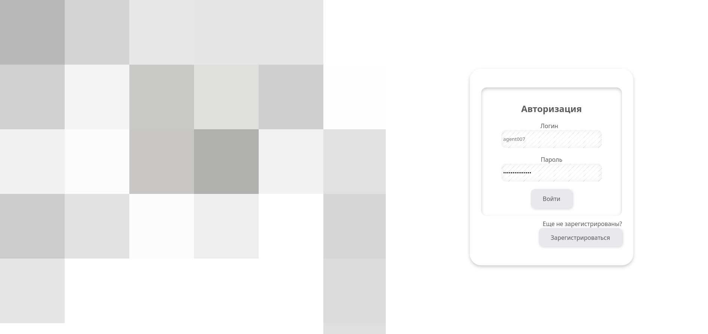
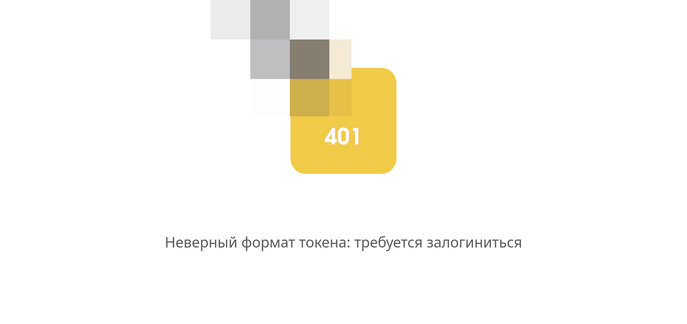
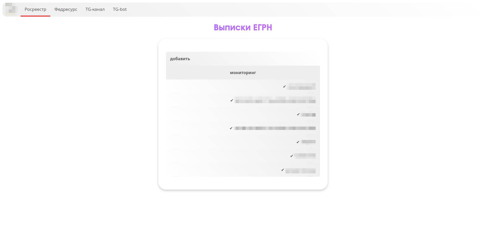
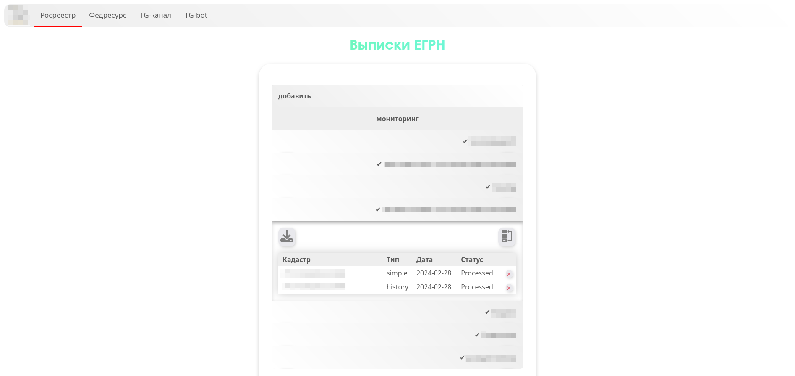
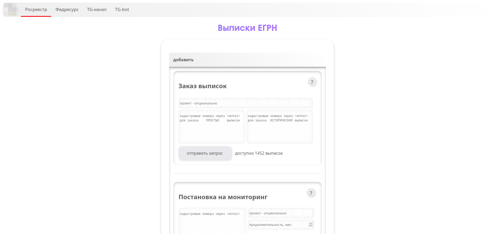
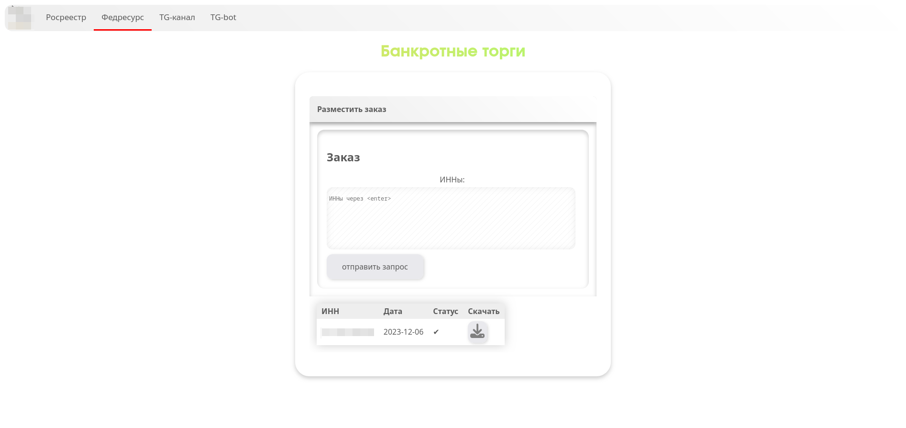

# Внутренний корпоративный сайт
<!-- TOC start -->
- [BACKEND](#backend)
   - [STACK](#stack)
- [FRONTEND DEMO](#frontend-demo)
   - [ОБЩЕЕ](#fe-common)
   - [РОСРЕЕСТР](#fe-egrn)
   - [ЕФРСБ](#fe-efrsb)
<!-- TOC end -->

<!-- TOC -->
## BACKEND
Бэкенд сайта позволяет заказывать выписки из РОСРЕЕСТРА (через подрядчика) и скачивать информацию по банкротным торгам с ЕФРСБ (скрапинг fedresurs.ru)
<!-- TOC -->
### STACK
#### Общее
- python
- loguru
- celery
- pandas

#### WEB
- fastapi
- gunicorn
- sqladmin

#### Базы данных
- sqlalchemy
- alembic
- redis

#### Скрапинг
- scrapy
- aiohttp

<!-- TOC -->
## FRONTEND DEMO
<!-- TOC -->
### ОБЩЕЕ

<!-- TOC -->
### РОСРЕЕСТР

<!-- TOC -->
### ЕФРСБ

